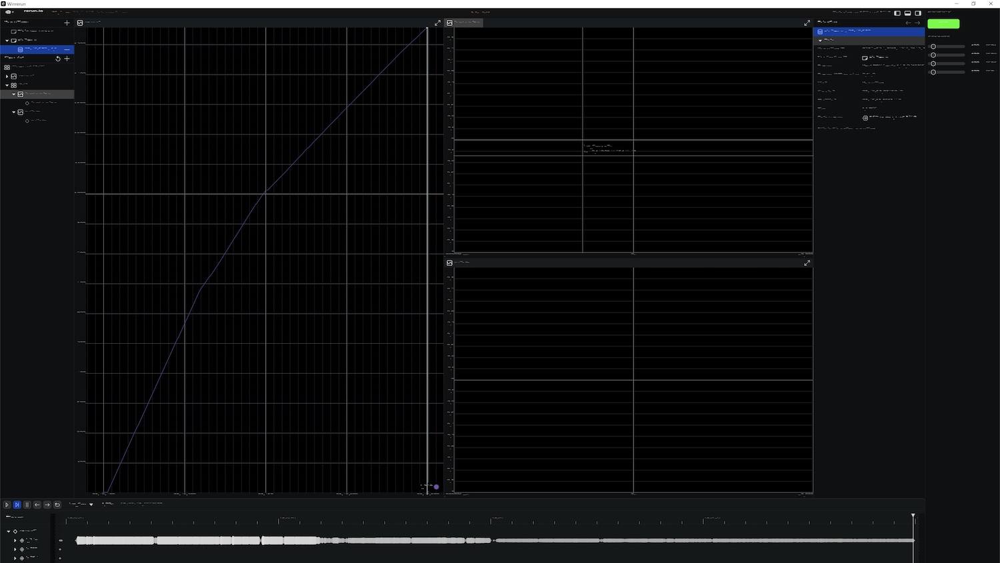

# Rerun font problem demonstration for Windows

On macOS all fonts are nice but on Windows 10 VM running on macOS they are broken.
Tested with rust `1.79.0`.

https://github.com/rerun-io/rerun/issues/7177



## Run
```rust
cargo run

[2024-08-14T09:42:39.254Z INFO  re_sdk_comms::server] Hosting a SDK server over TCP at 0.0.0.0:9876. Connect with the Rerun logging SDK.
[2024-08-14T09:42:39.258Z INFO  eframe] Both the glow and wgpu renderers are available. Using wgpu.
[2024-08-14T09:42:39.521Z INFO  wgpu_core::instance] Adapter Gl AdapterInfo { name: "Parallels using AMD Radeon Pro 5700 XT OpenGL Engine (Compat)", vendor: 0, device: 0, device_type: Other, driver: "OpenGL", driver_info: "4.1 ATI-5.5.17", backend: Gl }
[2024-08-14T09:42:39.526Z INFO  wgpu_core::instance] Adapter Gl AdapterInfo { name: "Parallels using AMD Radeon Pro 5700 XT OpenGL Engine (Compat)", vendor: 0, device: 0, device_type: Other, driver: "OpenGL", driver_info: "4.1 ATI-5.5.17", backend: Gl }
[2024-08-14T09:42:39.703Z INFO  re_sdk_comms::server] New SDK client connected from: 127.0.0.1:62137
```
